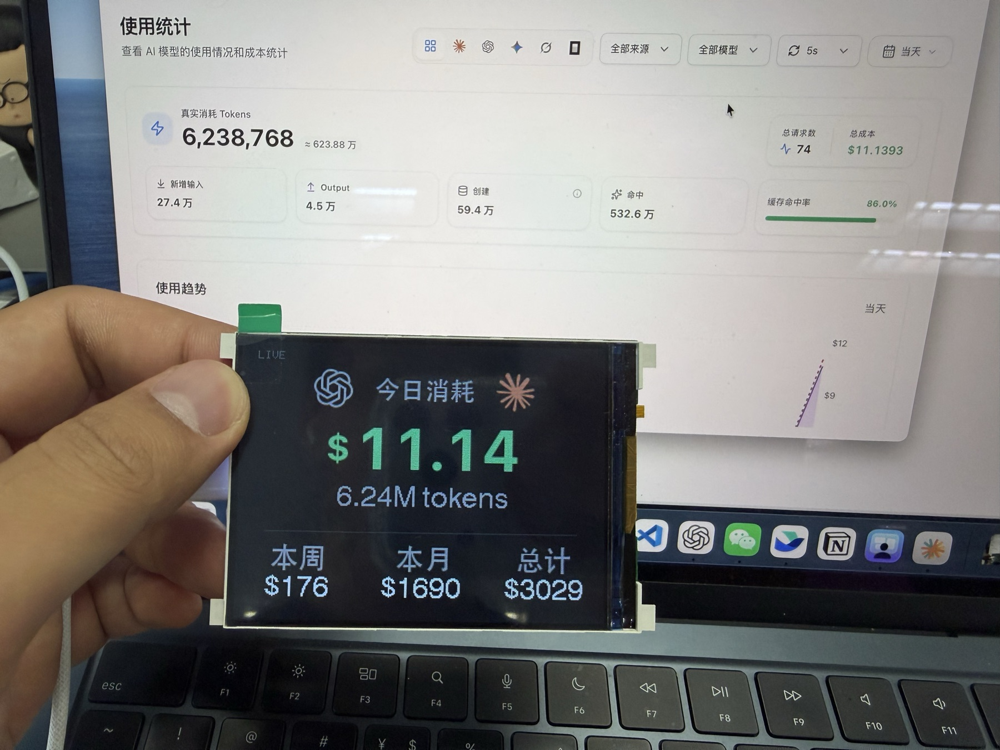
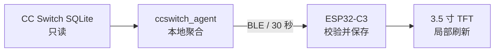

# DeskBurn

放在工位上的 AI Token 与费用实时消耗屏。

DeskBurn 使用 ESP32-C3 驱动一块 3.5 寸 TFT 屏幕。Mac 端只读 CC Switch 的
本地 SQLite 数据库，计算今日、本周、本月和累计的费用与 Token 数，再通过 BLE
每 30 秒推送到屏幕。整个链路不需要云服务，也不会把 Prompt、回复正文或 API Key
发给设备。



## 特性

- 今日费用和 Token 数突出显示，本周、本月和累计分栏展示费用与 Token 数。
- Mac 侧以 SQLite 只读模式访问 CC Switch 数据库。
- 使用 BLE 直连，不依赖 Wi-Fi、局域网连通性或公网中转。
- 断线后保留最后一次有效数据，并在 90 秒超时后显示 `OFFLINE`。
- ESP32 使用 NVS 保存最近数据，设备重启后不会先显示误导性的零值。
- 局部刷新数值区域，避免整屏重绘造成闪烁。
- Mac 登录后可由 launchd 自动启动，链路断开后自动重连。
- Python 协议测试会编译真实 C++ 头文件，校验两端字段、字节序和 CRC 一致。

## 工作方式



当前数据适配器针对 CC Switch。BLE 协议和屏幕渲染彼此独立，后续可以添加新的
本地数据源，而不需要改动设备端的数据展示逻辑。

## 硬件

当前经过实物验证的组合：

| 部件 | 配置 |
|---|---|
| 主控 | AirM2M CORE ESP32-C3，4MB Flash |
| 屏幕 | 3.5 寸 TFT，240×320 原生分辨率 |
| 横屏分辨率 | 320×240，`setRotation(1)` |
| 驱动 | ST7789 兼容初始化序列，BGR 色序 |
| 通信 | Bluetooth Low Energy |
| 日常供电 | 5V USB |

引脚、实物照片和装配信息见[硬件说明](docs/硬件说明.md)。

## 快速开始

### 1. 准备环境

- macOS
- Python 3.10 或更高版本
- PlatformIO Core
- CC Switch，以及默认位置的 `~/.cc-switch/cc-switch.db`
- 一块已连接目标 TFT 的 ESP32-C3

```bash
git clone https://github.com/wnqnxbb/DeskBurn.git
cd DeskBurn

python3 -m venv .venv
.venv/bin/pip install -r requirements.txt
```

### 2. 运行测试

```bash
cd tools
../.venv/bin/python -m unittest discover -s tests
cd ..
```

### 3. 编译并烧录固件

```bash
pio run -e deskburn
pio run -e deskburn -t upload
```

PlatformIO 默认自动发现串口。连接了多个串口设备时，可以显式指定：

```bash
pio run -e deskburn -t upload --upload-port /dev/cu.usbmodemXXXX
```

### 4. 验证 Mac 到屏幕的链路

先用假数据确认 BLE 和屏幕刷新正常：

```bash
cd tools
../.venv/bin/python -m ccswitch_agent --serve --fake
```

确认屏幕出现测试数据后按 `Ctrl-C`，再读取真实数据库：

```bash
../.venv/bin/python -m ccswitch_agent
../.venv/bin/python -m ccswitch_agent --serve
```

macOS 首次访问蓝牙时会请求授权，请允许当前 Python 解释器使用蓝牙。

### 5. 设置登录自启

```bash
cd ..
.venv/bin/python tools/install_launchd.py install
```

状态命令也可以从 `tools` 目录运行：

```bash
cd tools
../.venv/bin/python -m ccswitch_agent --status
```

完整安装、烧录、串口和日志轮转说明见[构建流程](docs/构建流程.md)。

## 仓库结构

```text
firmware/
  deskburn/                正式仪表盘、BLE 从机和协议
  pin_scanner/             屏幕引脚与初始化序列扫描固件
tools/
  ccswitch_agent/          CC Switch 聚合、协议与 BLE central
  tests/                   聚合与跨语言协议测试
  launchd/                 macOS 自启和日志轮转模板
  generate_assets.py       SVG / 中文 / 金额字形生成器
docs/
  硬件说明.md
  踩坑记录.md
  构建流程.md
```

## 文档

- [硬件说明](docs/硬件说明.md)：实物照片、板卡参数、屏幕参数和引脚。
- [踩坑记录](docs/踩坑记录.md)：屏幕、字节序、数据聚合、BLE 和烧录经验。
- [构建流程](docs/构建流程.md)：环境准备、测试、固件构建、烧录和自启。

## 安全与隐私

- 数据库连接使用 SQLite `mode=ro`，采集端无法通过该连接写入 CC Switch。
- BLE 包只含聚合金额、Token 数、时间戳、协议版本和 CRC。
- Prompt、模型回复、请求正文、Cookie、API Key 和数据库文件都不会发给 ESP32。
- 当前 BLE characteristic 未启用配对加密。射程内设备理论上可以写入伪造数字，
  但不能借此读取 Mac 数据；合法推送会在下一轮覆盖显示。
- 不要提交本地数据库、设备 Flash 备份、企业网络凭据或 `secrets*.h`。

## 已知限制

- 当前 Mac 采集端只支持 CC Switch 的数据库结构。
- 仪表盘的引脚和分辨率针对本文记录的 ESP32-C3 + TFT 组合；其他屏幕应先运行
  `pin_scanner` 并调整 `platformio.ini`。
- 资源生成脚本使用 macOS 自带字体；仓库已包含生成好的 `assets.h`，普通编译
  不依赖这些字体。

## License

代码以 [MIT License](LICENSE) 发布。

OpenAI、Claude 及其标识是各自权利人的商标。本项目仅将标识用于说明所统计的
模型来源，不代表这些公司对 DeskBurn 的认可或赞助。
