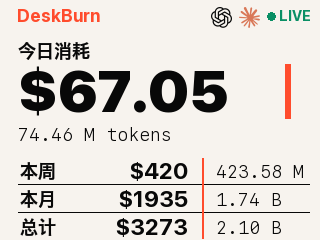
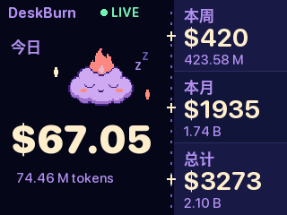
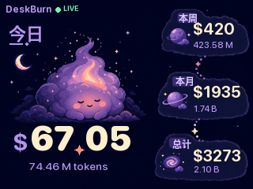

# 屏幕展示版本

DeskBurn 的数据采集、BLE 协议和屏幕页面彼此独立。所有展示版本接收同一套今日、
本周、本月、总计金额与 Token 数据，切换页面不需要修改 Mac 端服务。

四套页面的完整图片与视觉说明见[屏幕风格图鉴](屏幕风格图鉴.md)。

## Classic

经典深色仪表盘，突出今日金额，并把三个周期分栏展示。

```bash
pio run -e deskburn -t upload
```

源代码位于 `firmware/deskburn/`。

## Swiss Poster



瑞士平面海报风格使用暖白纸张背景、近黑色无衬线大字、橙红色专色线条和严格的
底部表格网格。参考图左上角的小图标没有保留，页面直接以 `DeskBurn` 文字起排。

```bash
pio run -e deskburn_swiss -t upload
```

源代码位于 `firmware/deskburn_swiss/`，其字体和图标资源可重新生成：

```bash
.venv/bin/python tools/generate_swiss_assets.py
```

## Midnight Buddy



Midnight Buddy 是第三套深色页面，但没有复用 Classic 的上下分区。它把屏幕改为
非对称左右分屏：左侧以今日金额和睡眠火焰小精灵形成陪伴主舞台，右侧以三段纵向
足迹展示本周、本月和总计。深海军蓝、薰衣草紫、蜜桃粉和薄荷绿共同构成夜间可爱
气质，圆体数字在 320×240 原生尺寸下仍保持清晰。

```bash
pio run -e deskburn_buddy -t upload
```

源代码位于 `firmware/deskburn_buddy/`。生成器会把去背角色、固定文案和动态圆体
字形转换为 RGB565 / alpha 固件资源，并同步输出原生尺寸预览：

```bash
.venv/bin/python tools/generate_buddy_assets.py
```

## Cosmic Buddy



Cosmic Buddy 是第四套独立页面。它把左侧今日区域扩展为完整月夜插画主舞台，
以月牙、云层和火焰云精灵承载情绪；本周、本月和总计分别进入右侧三座不规则星球
数据岛，并由星点轨迹连接。它与 Midnight Buddy 的平面分屏和连续数据带没有复用
关系。

```bash
pio run -e deskburn_cosmic -t upload
```

源代码位于 `firmware/deskburn_cosmic/`。生成器把 Image Gen 无文字美术层转换为
全屏 RGB565 背景，并生成中文、状态、金额和 Token 的 alpha 字形；预览与固件
使用相同坐标：

```bash
.venv/bin/python tools/generate_cosmic_assets.py
```

## 快速切换与成品固件

可烧录成品、写入地址和命令见 `firmware/releases/README.md`。四版保持相同的：

- BLE 设备名 `DeskBurn`
- Service / Characteristic UUID
- v3 数据协议
- NVS 命名空间与最后一次有效数据

因此使用 `app.bin` 在四版之间切换后，原来的 Mac 后台服务会自动重新连接。
