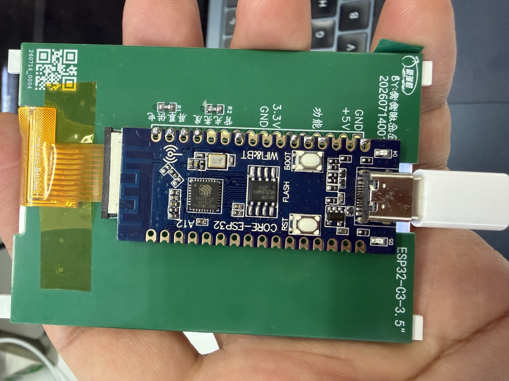
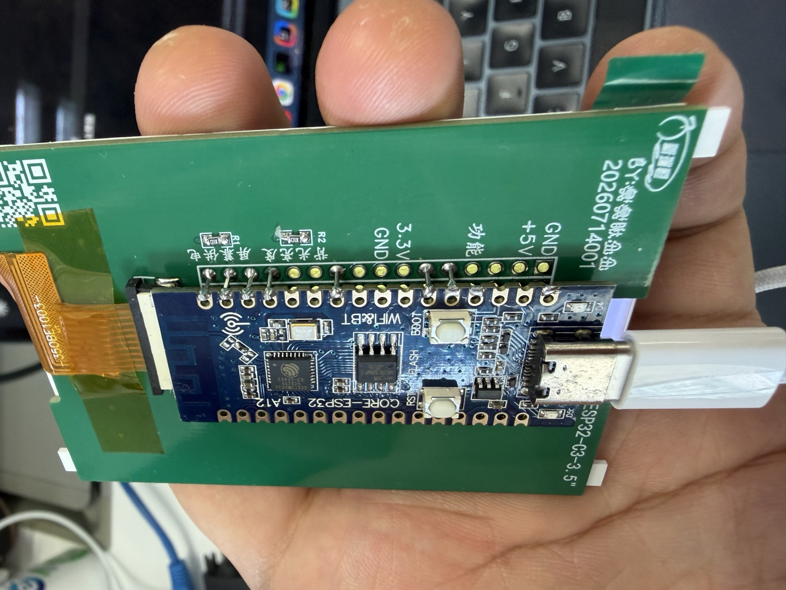
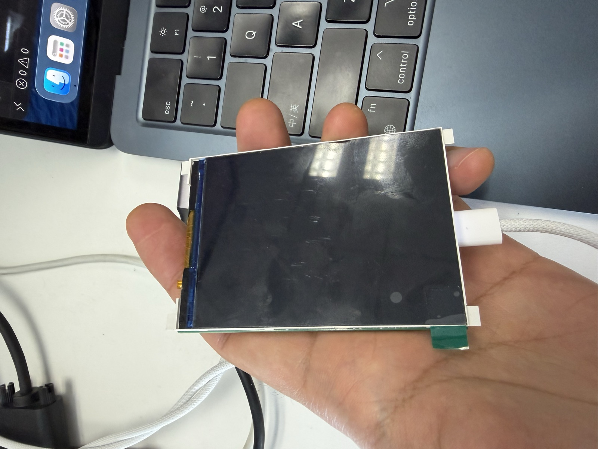
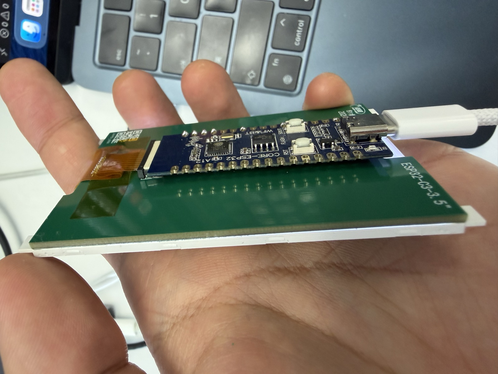

# DeskBurn 硬件说明

本文记录第一套 DeskBurn 实机使用的主控板、屏幕、连接参数和实物结构。所有
引脚与屏幕参数均来自实测；更换板卡或屏幕批次后，应先运行 `pin_scanner`，
不要直接假定参数相同。

## 整机结构

DeskBurn 由三部分组成：

1. 3.5 寸 240×320 TFT 面板；
2. 标有 `ESP32-C3-3.5"` 的绿色屏幕转接板；
3. AirM2M CORE ESP32-C3 主控板。

日常使用只需要 5V USB 供电。USB 数据连接仅用于首次烧录、升级固件和查看串口
日志；正常数据显示通过 BLE 完成。

## 实物照片

### 主控板与转接板



主控板直接焊接在绿色转接板背面。照片中可以看到 ESP32-C3、4MB Flash、
BOOT/RST 按钮、Type-C 接口和板载天线。

### 焊接与排针连接



侧视图用于确认主控板与转接板的连接方式。重新装配时要避免焊锡桥接相邻焊盘，
也不要让金属外壳或支架碰到裸露焊点。

### 屏幕正面



面板物理尺寸为 3.5 寸。未上电时无法从外观判断分辨率；本机实测原生分辨率为
240×320，横屏旋转后为 320×240。

### 整机厚度



主控板位于屏幕后方，适合固定在显示器边缘或放入 3D 打印外壳。设计外壳时应给
Type-C 插头、BOOT/RST 按钮和 ESP32 天线区域留出空间。

## 主控板参数

| 项目 | 值 |
|---|---|
| 开发板 | AirM2M CORE ESP32-C3 |
| PCB 丝印 | `CORE-ESP32 A12`、`WiFi&BT` |
| PlatformIO board | `airm2m_core_esp32c3` |
| SoC | ESP32-C3，单核 RISC-V |
| Flash | 4MB，DIO，80MHz |
| 无线 | 2.4GHz Wi-Fi、Bluetooth 5 LE |
| USB | ESP32-C3 原生 USB Serial/JTAG |
| 板载 LED | GPIO12、GPIO13 |

## 屏幕参数

| 项目 | 实测配置 |
|---|---|
| 物理尺寸 | 3.5 寸 |
| 原生分辨率 | 240×320 |
| 使用方向 | `setRotation(1)`，320×240 横屏 |
| 初始化序列 | 通用 ST7789 序列可稳定驱动 |
| 色序 | BGR |
| 反显 | 需要 `INVON` |
| SPI 频率 | 20MHz |
| 触摸 | 未确认，当前项目不使用 |

转接板未引出 LCD MISO，因此无法回读控制器 ID。这里的准确结论是“卖家标注为
ST7789，且通用 ST7789 初始化序列能稳定驱动”，不是通过寄存器独立确认了芯片
型号。

## 引脚

| LCD 信号 | ESP32-C3 GPIO | 说明 |
|---|---:|---|
| SCLK | **GPIO2** | 板载默认 SPI 时钟 |
| MOSI | GPIO3 | 显示数据 |
| CS | GPIO7 | 片选 |
| DC | GPIO4 | 数据/命令选择 |
| RST | GPIO5 | 屏幕复位 |
| BL | GPIO6 | 背光控制 |
| MISO | 未引出 | 无法回读控制器 |

最容易接错的是 SCLK：GPIO10 是这块主控的默认 MISO，不是 SCLK。只有背光、
画面全黑但程序仍正常运行时，应优先检查 GPIO2 的时钟连接。

这些引脚通过 `platformio.ini` 的 `build_flags` 注入 TFT_eSPI，不需要修改依赖
库里的 `User_Setup.h`。

## 供电与放置

- 使用显示器 USB 口或稳定的 5V USB 电源。
- 设备放在显示器边缘时，应避免拉扯 FPC 排线。
- 不要让屏幕背面焊点直接接触金属支架。
- ESP32-C3 天线附近尽量不要被大面积金属遮挡，否则 BLE 重连距离会明显下降。
- 纽扣电池不适合给这类带背光的设备供电。

## 更换屏幕或主控板

仓库保留了 `firmware/pin_scanner/`，它使用最小 SPI 驱动在运行时轮换不同
初始化序列和引脚组合：

```bash
pio run -e pin_scanner
pio run -e pin_scanner -t upload
```

扫描画面只能帮助确认“哪组配置能出图”。颜色、边框和方向仍需要通过实物画面
分别核对，避免一次回答同时混入多个判断。
